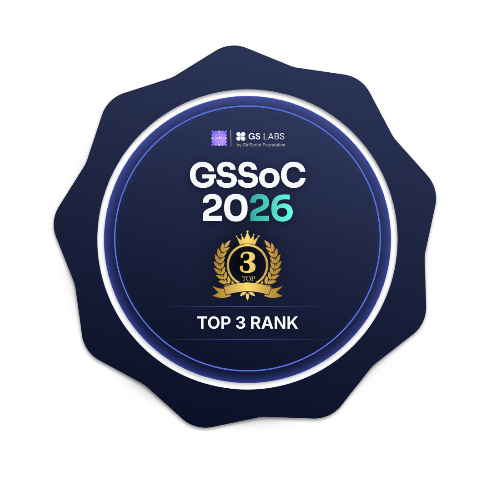
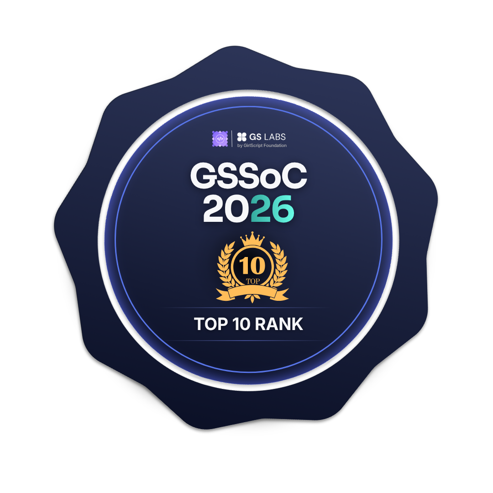
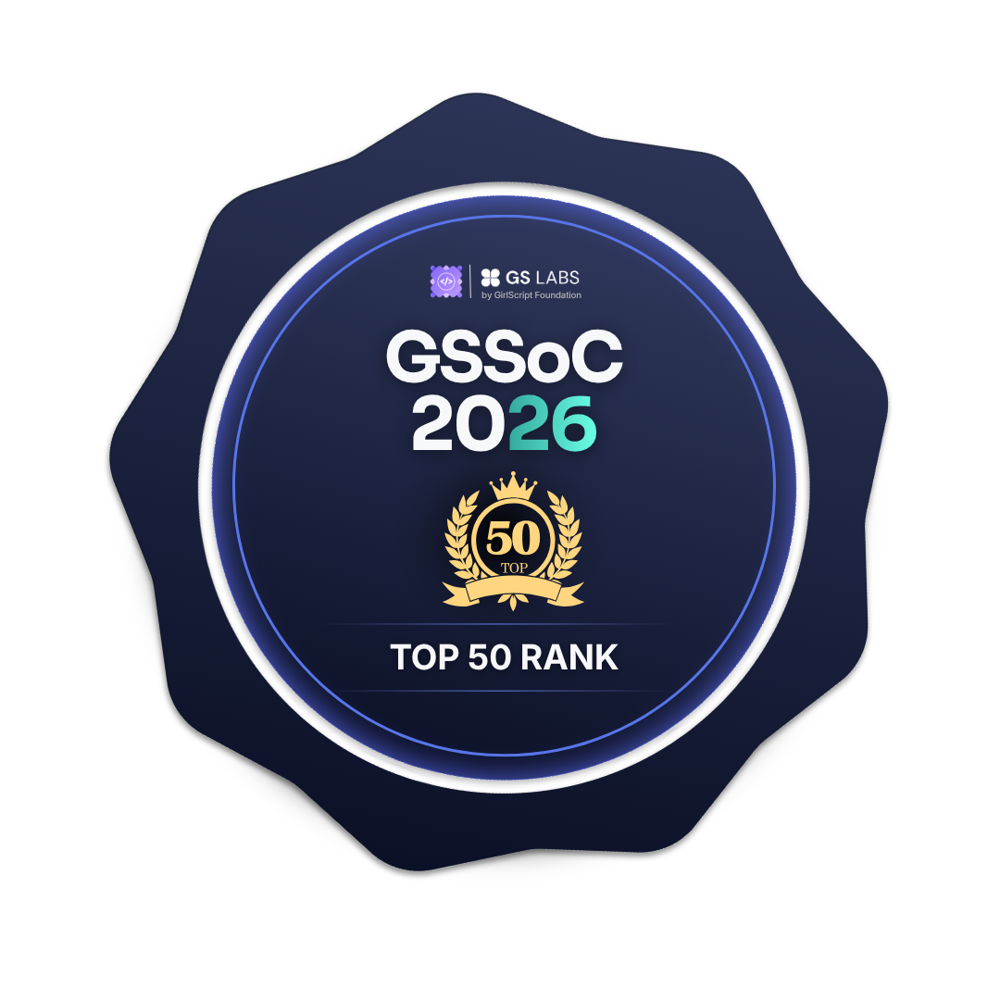
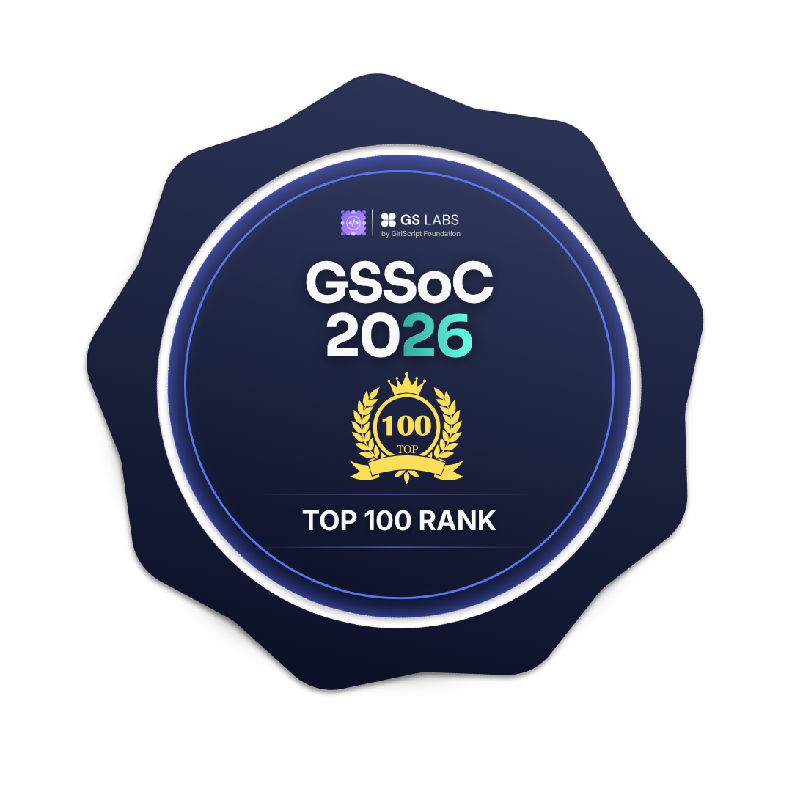
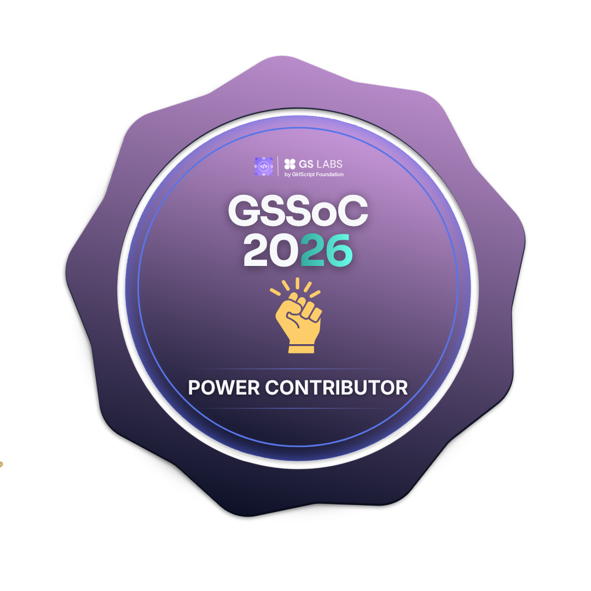
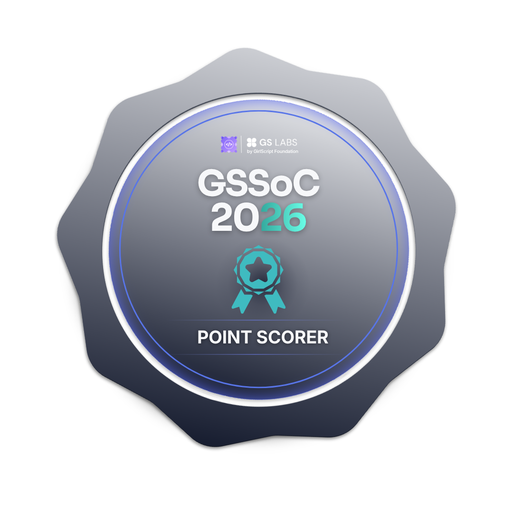
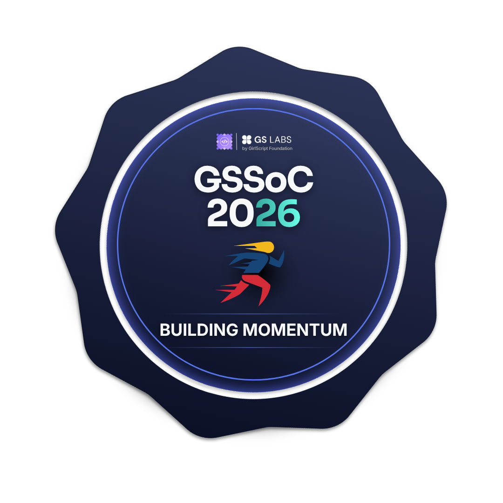
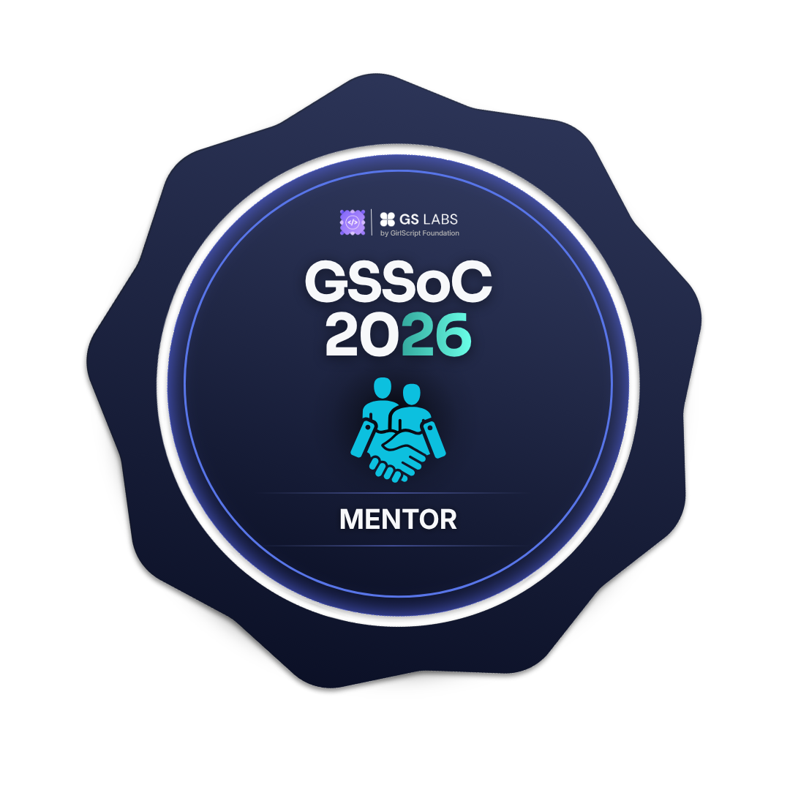
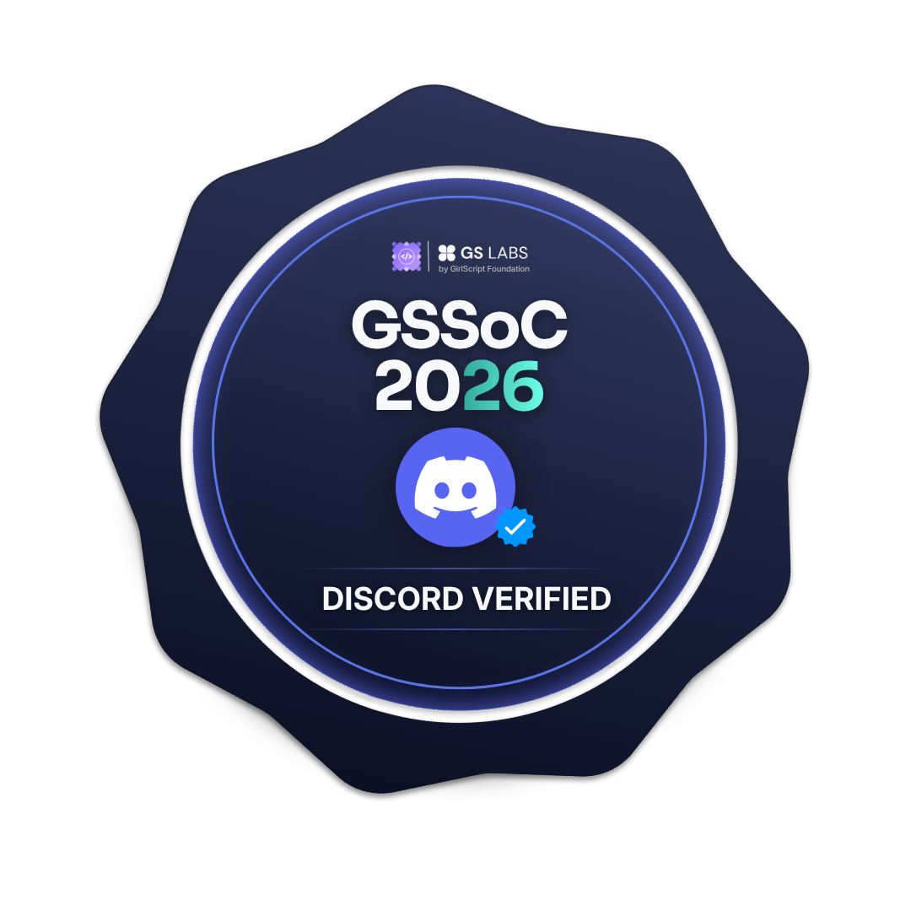

<!-- Animated Header -->


<!-- Typing Animation -->
<div align="center">
  
</div>

<br/>

<table align="center" border="0" cellspacing="0" cellpadding="0">
<tr>
  
<td width="50%" align="center">

</td>

<td width="50%" align="center">

</td>

</tr>
</table>

<br/>

<div align="center">
  
</div>

## 🎯 About Me

```typescript
const satyam = {
    pronouns: "He" | "Him",
    location: "India 🇮🇳",
    currentFocus: ["Full Stack Development", "AI/ML Engineering", "Cloud Architecture"],
    funFact: "I can build full-stack apps AND train ML models in the same day! 🚀",
    
    code: ["JavaScript", "TypeScript", "Python", "Java", "C++", "Go"],
    technologies: {
        frontEnd: {
            frameworks: ["React", "Next.js", "Vue", "Angular"],
            styling: ["Tailwind CSS", "Sass", "Styled Components", "Material-UI"],
            state: ["Redux", "Zustand", "Recoil", "Context API"]
        },
        backEnd: {
            js: ["Node.js", "Express", "Nest.js", "tRPC"],
            python: ["Django", "Flask", "FastAPI"],
            java: ["Spring Boot"]
        },
        aiMl: ["TensorFlow", "PyTorch", "Scikit-learn", "OpenCV", "Langchain"],
        databases: ["MongoDB", "PostgreSQL", "MySQL", "Redis", "Firebase"],
        cloud: ["AWS", "GCP", "Azure", "Vercel", "Netlify"],
        mobile: ["Flutter", "React Native"],
        devOps: ["Docker", "Kubernetes", "Jenkins", "GitHub Actions"]
    },
    currentlyLearning: ["RAG Systems", "T3 Stack", "Three.js", "IBM Watson"],
    askMeAbout: ["Web Dev", "AI/ML", "System Design", "Problem Solving"],
    challenge: "Building production-ready applications that scale"
};
```
<div align="center">

<br/>

<!-- Title -->


<br/>

<!-- Top Border -->


<br/>

<!-- Snake Animation -->
<picture>
  <source media="(prefers-color-scheme: dark)" srcset="https://raw.githubusercontent.com/SatyamPandey-07/SatyamPandey-07/output/github-contribution-grid-snake-dark.svg">
  <source media="(prefers-color-scheme: light)" srcset="https://raw.githubusercontent.com/SatyamPandey-07/SatyamPandey-07/output/github-contribution-grid-snake.svg">
  
</picture>

<br/>

<!-- Bottom Border -->


<br/>

<!-- Badges -->


<br/>

<!-- Bottom Text -->


<br/>

</div>


## 🌍 **Connect with Me**
<p align="center">
  <a href="https://www.linkedin.com/in/satyam-pandey-0b246432a/">
    
  </a>
  &nbsp;&nbsp;
  <a href="https://github.com/SatyamPandey-07">
    
  </a>
  &nbsp;&nbsp;
  <a href="https://leetcode.com/u/Satyampandey1802/">
    
  </a>
</p>


## 🛠️ Tech Arsenal

<table align="center" width="100%">
<tr>
<td width="50%" valign="top">

<h3 align="center">🎨 Frontend Universe</h3>
<p align="center">
  
</p>

<br/>

<h3 align="center">🔮 Backend & Database</h3>
<p align="center">
  
</p>

</td>
<td width="50%" valign="top">

<h3 align="center">🤖 AI/ML & Data Science</h3>
<p align="center">
  
  <br/>
  
  
  
  
</p>

<br/>

<h3 align="center">☁️ Cloud & DevOps</h3>
<p align="center">
  
</p>

</td>
</tr>
</table>

<br/>

<h3 align="center">📱 Mobile & Desktop</h3>
<p align="center">
  
</p>

<br/>

<h3 align="center">💻 Programming Languages</h3>
<p align="center">
  
</p>

<br/>

<h3 align="center">🛠️ Tools & Platforms</h3>
<p align="center">
  
</p>


## 📊 GitHub Stats

<div align="center">

<table align="center" border="0" cellspacing="0" cellpadding="0">
  <tr>
    <td align="center"></td>
    <td align="center"></td>
  </tr>
</table>

<br/>

<table align="center" border="0" cellspacing="0" cellpadding="0">
  <tr>
    <td align="center"></td>
    <td align="center"></td>
  </tr>
</table>

<br/>

<table align="center" border="0" cellspacing="0" cellpadding="0">
  <tr>
    <td align="center" width="50%"></td>
    <td align="center" width="50%"></td>
  </tr>
  <tr>
    <td align="center" width="50%"></td>
    <td align="center" width="50%"></td>
  </tr>
</table>

</div>

##  GitHub Trophies
<p align="center">
  
</p>


## 📈 Contribution Graph


## 🎯 Current Focus

<table align="center" width="100%">
<tr>
<td width="50%" valign="top">

<h3 align="center">🚀 Learning Path</h3>

```yaml
Advanced AI/ML:
  - Deep Learning & Neural Networks
  - Natural Language Processing
  - Computer Vision
  
RAG Systems:
  - Vector Databases (Pinecone, Weaviate)
  - Embedding Models
  - Semantic Search
  
Cloud Architecture:
  - Microservices Design
  - Serverless Computing
  - Container Orchestration
  
Modern Stacks:
  - T3 Stack (Next.js + tRPC + Prisma)
  - Three.js for 3D Web
  - IBM Watson AI
```

</td>
<td width="50%" valign="top">

<h3 align="center">💡 Project Ideas</h3>

```yaml
In Progress:
  - AI-Powered Full Stack App
  - Real-time Collaboration Tool
  - ML Model Deployment Platform
  
Planning:
  - Open Source Contributions
  - Tech Blog Platform
  - Developer Tools & Libraries
  
Goals:
  - Build Production-Ready Apps
  - Contribute to Major OSS Projects
  - Share Knowledge with Community
```

</td>
</tr>
</table>

## 🌟 **Community & Open Source**
### 📚 **Knowledge Sharing**
- 🔗 Regular contributor to open-source projects
- 🎯 Mentoring aspiring developers in MERN stack and Python
- 🏆 Active participant in hackathons and coding competitions

### 🤝 **Collaboration**
- 💡 Open to collaborating on innovative projects
- 🌍 Available for freelance and consulting work
- 📞 Contact me for technical discussions and partnerships

---

## 🏆 **GirlScript Summer of Code (GSSoC) Badges**

<div align="center">

<h3 align="center">🌟 Top Achievements</h3>

<table align="center" border="0" cellpadding="5" cellspacing="5">
  <tr align="center">
    <td align="center" width="110">
      <br/>
      <sub><b>GSSoC Champion</b></sub>
    </td>
    <td align="center" width="110">
      <br/>
      <sub><b>Rank 1</b></sub>
    </td>
    <td align="center" width="110">
      <br/>
      <sub><b>Top 3</b></sub>
    </td>
    <td align="center" width="110">
      <br/>
      <sub><b>Top 10</b></sub>
    </td>
  </tr>
  <tr align="center">
    <td align="center" width="110">
      <br/>
      <sub><b>Elite</b></sub>
    </td>
    <td align="center" width="110">
      <br/>
      <sub><b>Rising Star</b></sub>
    </td>
    <td align="center" width="110">
      <br/>
      <sub><b>Top 50</b></sub>
    </td>
    <td align="center" width="110">
      <br/>
      <sub><b>Top 100</b></sub>
    </td>
  </tr>
</table>

<br/>

<h3 align="center">⚡ Bounties & Streaks</h3>

<table align="center" border="0" cellpadding="5" cellspacing="5">
  <tr align="center">
    <td align="center" width="105">
      <br/>
      <sub><b>Bounty Master</b></sub>
    </td>
    <td align="center" width="105">
      <br/>
      <sub><b>Bounty Hunter</b></sub>
    </td>
    <td align="center" width="105">
      <br/>
      <sub><b>Power Contributor</b></sub>
    </td>
    <td align="center" width="105">
      <br/>
      <sub><b>Prolific</b></sub>
    </td>
    <td align="center" width="105">
      <br/>
      <sub><b>Point Scorer</b></sub>
    </td>
    <td align="center" width="105">
      <br/>
      <sub><b>Building Momentum</b></sub>
    </td>
    <td align="center" width="105">
      <br/>
      <sub><b>On a Roll</b></sub>
    </td>
  </tr>
</table>

<br/>

<h3 align="center">🗺️ Journey & Roles</h3>

<table align="center" border="0" cellpadding="5" cellspacing="5">
  <tr align="center">
    <td align="center" width="105">
      <br/>
      <sub><b>Role Mentor</b></sub>
    </td>
    <td align="center" width="105">
      <br/>
      <sub><b>Role Contributor</b></sub>
    </td>
    <td align="center" width="105">
      <br/>
      <sub><b>Week One</b></sub>
    </td>
    <td align="center" width="105">
      <br/>
      <sub><b>First Steps</b></sub>
    </td>
    <td align="center" width="105">
      <br/>
      <sub><b>Getting Started</b></sub>
    </td>
    <td align="center" width="105">
      <br/>
      <sub><b>Discord Verified</b></sub>
    </td>
    <td align="center" width="105">
      <br/>
      <sub><b>Profile Complete</b></sub>
    </td>
  </tr>
</table>

</div>

---


## 🎯 **Fun Facts About Me**  
✅ **Coding keeps me alive** – I can sit and build projects for hours  
✅ Can switch between **Python ML models** and **React components** seamlessly  
✅ I believe in **code that tells a story** and **design that speaks volumes**  


## 📊 **LeetCode Journey**

### 🎯 **LeetCode Badges & Achievements**
<div align="center">
  
[](https://leetcode.com/u/Satyampandey1802/)
[](https://leetcode.com/u/Satyampandey1802/)
[](https://leetcode.com/u/Satyampandey1802/)

</div>

### 📈 **Coding Stats & Progress**
<div align="center">
  
<!-- LeetCode Stats Card -->
<a href="https://leetcode.com/u/Satyampandey1802/">
  
</a>

</div>

### 🎖️ **Achievements**
<div align="center">
  
[](https://leetcode.com/u/Satyampandey1802/)
[](https://leetcode.com/u/Satyampandey1802/)

</div>

### 💪 **Coding Consistency**
<p align="center">
  <em>"Consistency is key to mastering algorithms and data structures!"</em><br>
</p>

---

## 💖 **Show Some Love!**

💖 **Drop a star** ⭐ on my repositories if you like my work! 🚀  
🤝 **Fork** and **contribute** to make them even better!  
📢 **Share** my projects with your network!  

Let's build something awesome together. Happy coding! 🎉  


<div align="center">

**🌟 Made with ❤️ by [Satyam Pandey](https://github.com/SatyamPandey-07) 🌟**

*"Code is poetry written in logic, and I'm here to compose symphonies!"* 🎵

</div>

---

### 📈 **Profile Views**
<p align="center">
  
</p>

---

### 📈 **GitHub Stats Summary**
<div align="center">
  

&nbsp;&nbsp;

&nbsp;&nbsp;


</div>

---

 <em><b>I love connecting with different people</b> so if you want to say <b>hi, I'll be happy to meet you!</b> 😊</em>

<div align="center">
  
</div>


