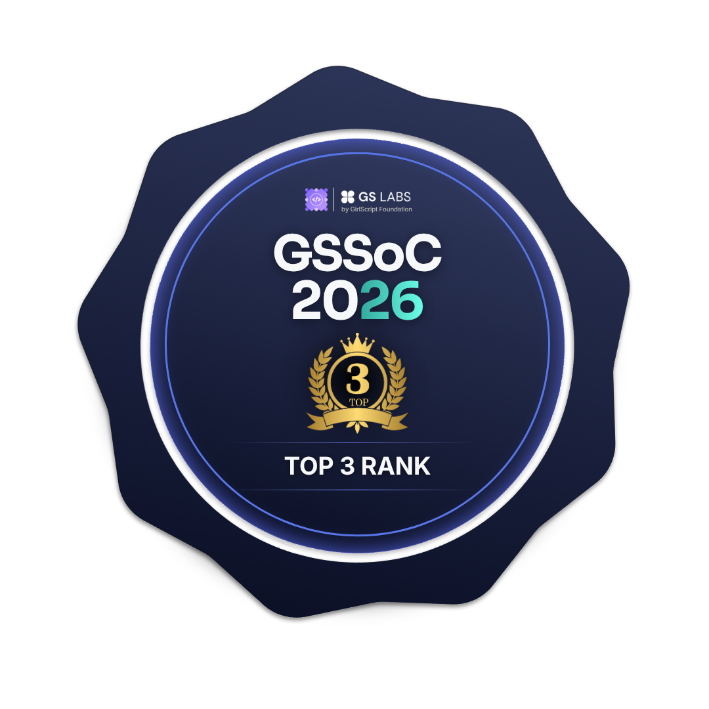
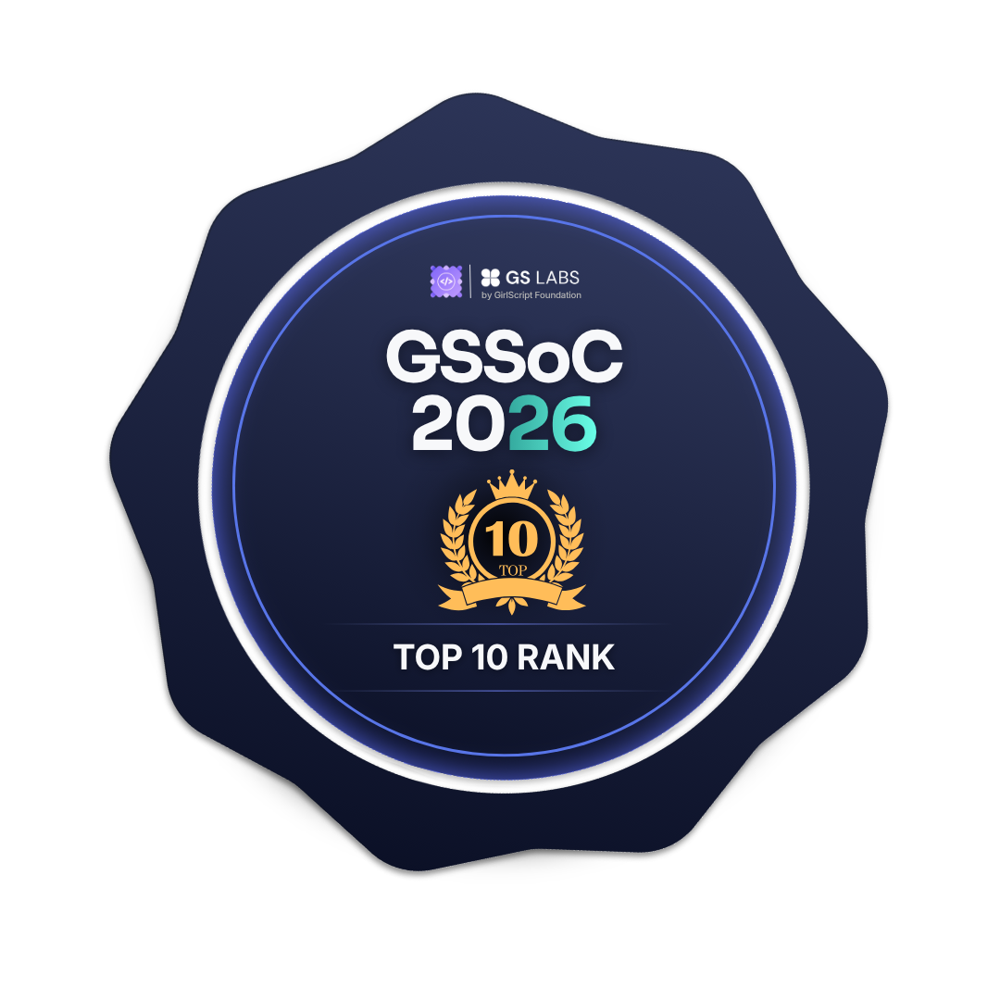
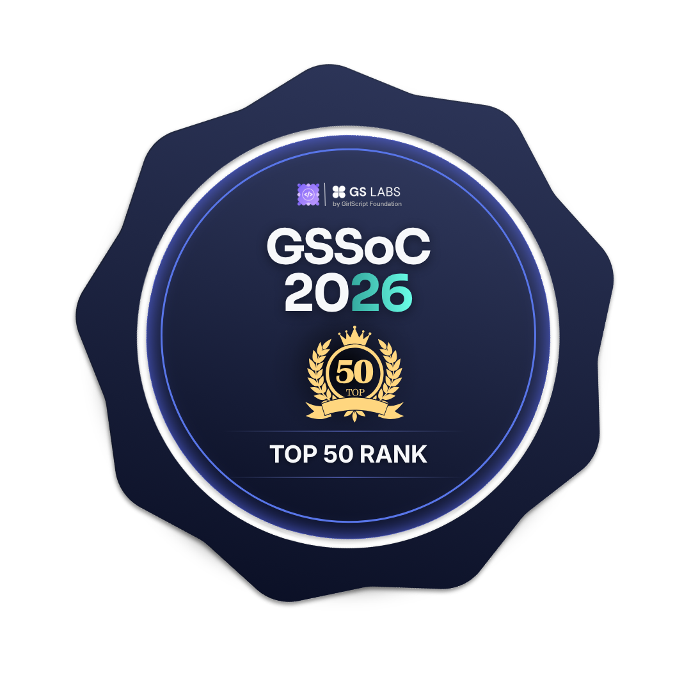
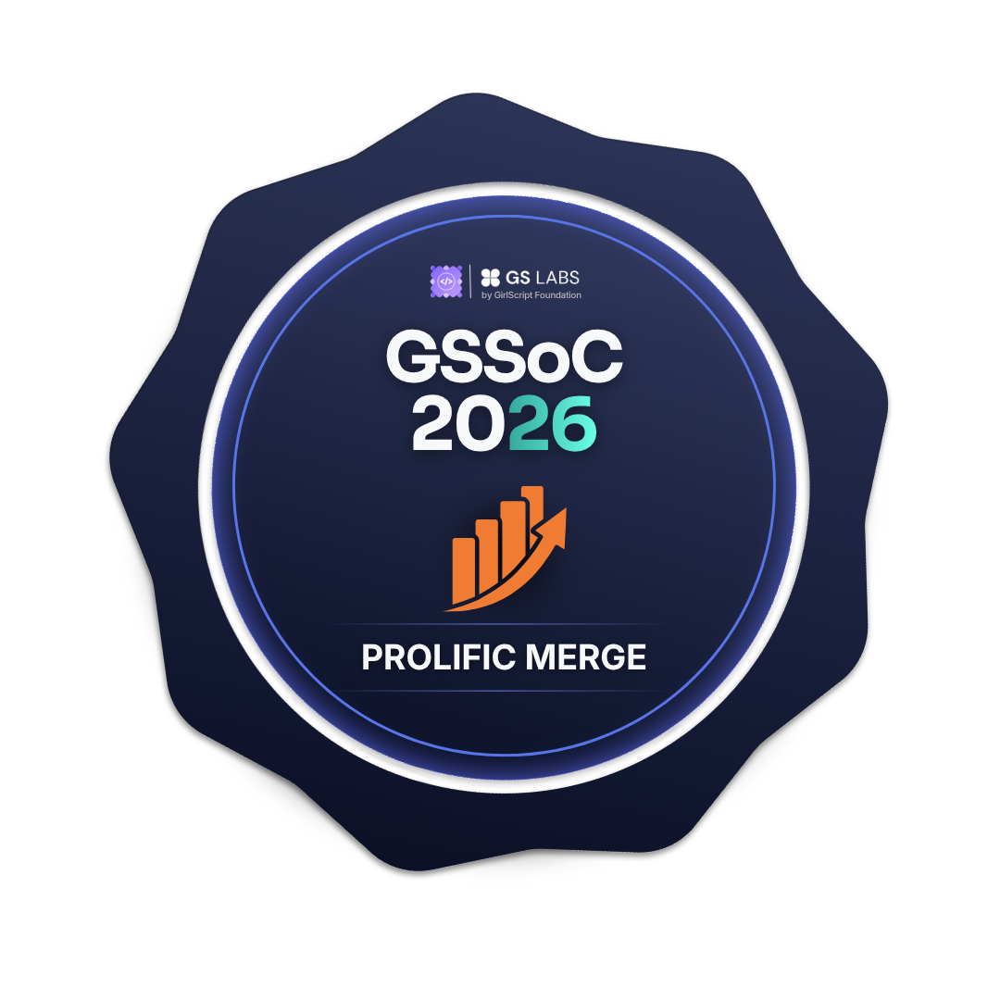
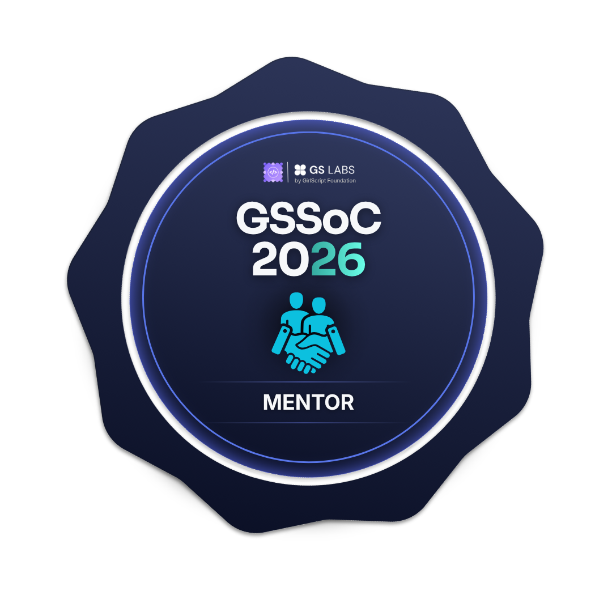

<!-- Animated Header -->


<!-- Typing Animation -->
<div align="center">
  
</div>

<br/>

<!-- Quick GitHub Stats Badges -->
<div align="center">
  <a href="https://github.com/SatyamPandey-07">
    
  </a>
  &nbsp;
  <a href="https://github.com/SatyamPandey-07?tab=followers">
    
  </a>
  <a href="https://leetcode.com/u/Satyampandey1802/">
    
  </a>
  &nbsp;
  <a href="https://codeforces.com/profile/saam-pande">
    
  </a>
  &nbsp;
  <a href="https://github.com/SatyamPandey-07?tab=repositories">
    
  </a>
  &nbsp;
  <a href="https://github.com/open-telemetry/opentelemetry-go-compile-instrumentation">
    
  </a>
  &nbsp;
  <a href="https://github.com/SatyamPandey-07?tab=repositories">
    
  </a>
</div>

<br/>

<table align="center" border="0" cellspacing="0" cellpadding="0">
<tr>
  
<td width="50%" align="center">

</td>

<td width="50%" align="center">

</td>

</tr>
</table>

<br/>


## 🎯 About Me

```typescript
const satyam = {
    identity: "Satyam Pandey",
    pronouns: "He" | "Him",
    location: "Mumbai, India 🇮🇳",
    education: "Thadomal Shahani Engineering College (TSEC '28) — CGPA: 8.60/10",
    
    currentFocus: [
        "CNCF OpenTelemetry Core Development",
        "Systems & Distributed Tracing in Go",
        "Autonomous Multi-Agent AI (Model Context Protocol)",
        "High-Throughput Full-Stack & ML Architectures"
    ],
    
    openSource: {
        org: "Cloud Native Computing Foundation (CNCF)",
        repo: "open-telemetry/opentelemetry-go-compile-instrumentation",
        impact: "15 Pull Requests across MongoDB auto-instrumentation, Kafka tracing, compiler AST tooling & CI coverage gates"
    },

    podiumRecord: [
        "🏆 1st Prize — SYN3RGY 3.0 National Hackathon (Themis Multi-Agent OS in Go)",
        "🏆 1st Place — Augenblick National Hackathon 2026 (Gallifrey VAE Anomaly Detection)",
        "🏆 1st Place — IdeaForge National Hackathon 2026",
        "🥉 2nd Runner-Up — DataHacks 4.0 Hackathon (y.ai XAI Platform, DJSCE)",
        "🥇 Top 3 Contributor Pan-India — GirlScript Summer of Code (10,000+ devs)",
        "🎖️ Rank #4 — Elite Coders Winter of Code (5,000+ devs)"
    ],
    
    code: ["Go", "Modern C++", "Python", "TypeScript", "JavaScript", "Java", "SQL", "Bash"],
    
    technologies: {
        systemsAndCloud: ["Linux Internals", "Distributed Tracing", "Docker", "Kubernetes", "gRPC", "GitHub Actions"],
        aiAgentsAndLLMs: ["Model Context Protocol (MCP)", "ReAct Framework", "LangChain", "LangGraph", "Multi-Agent Systems", "PyTorch", "GNNs", "XAI (SHAP/DiCE)"],
        frontEnd: ["Next.js", "React.js", "Three.js", "GSAP", "Framer Motion", "Tailwind CSS", "PWA"],
        backEnd: ["Go Tooling", "Node.js", "Express", "FastAPI", "Spring Boot", "GraphQL"],
        databases: ["Qdrant", "TimescaleDB", "PostgreSQL", "MongoDB", "Redis", "ChromaDB", "FAISS"]
    },
    
    funFact: "I can build autonomous agent systems in Go AND compile-time AST instrumentations in the same sprint! 🚀",
    askMeAbout: ["Systems Engineering", "OpenTelemetry", "Autonomous Agents (MCP)", "Hackathons", "DSA"],
    challenge: "Building resilient, zero-overhead systems that scale globally"
};
```

---

## 🏆 Featured Flagship Builds

<table width="100%">
<tr>
<td width="50%" valign="top">

### 🤖 [Themis — Autonomous Multi-Agent OS](https://github.com/SatyamPandey-07/UntrainedModels_Syn3rgy_SatyamUttamPandey)
`Go` • `Bubble Tea` • `MCP` • `Qdrant` • `SQLite` • `ReAct`
* Autonomous multi-agent developer system built with a Go TUI and Model Context Protocol (MCP).
* Coordinates specialized agents for orchestration, architecture validation, debugging, testing, and git operations.
* **🏆 Won 1st Prize at SYN3RGY 3.0 National Hackathon (DJ Sanghvi, Mumbai).**

</td>
<td width="50%" valign="top">

### 🧬 [MEDICA — Oncology Intelligence Platform](https://github.com/SatyamPandey-07/MEDICA)
`LLMs` • `Knowledge Graphs` • `Hybrid Search` • `FastAPI` • `Next.js`
* AI-driven oncology research intelligence engine with hybrid semantic search and knowledge graph groundings.
* Built as a Forward Deployed Engineer at *Augenblick Consulting*.
* **[GitHub Repository](https://github.com/SatyamPandey-07/MEDICA)**

</td>
</tr>
<tr>
<td width="50%" valign="top">

### 📡 [Gallifrey — AI Structural Health Monitor](https://github.com/aezyus/gallifrey)
`Python` • `Wavelets` • `VAE` • `TimescaleDB` • `Docker`
* Real-time anomaly detection over IoT sensor streams using Wavelet transforms and Variational Autoencoders (VAE).
* **🏆 1st Place — Augenblick Hackathon 2026 (won direct summer internship).**

</td>
<td width="50%" valign="top">

### 🧠 [y.ai — Explainable AI Platform](https://github.com/DataHack4-0/UntrainedModels/)
`Next.js` • `FastAPI` • `PyTorch` • `GNN` • `SHAP/DiCE` • `Kubernetes`
* Explainable learning intelligence platform with Graph Neural Networks, BERTopic clustering, LambdaMART ranking, and causal inference.
* **🥈 2nd Runner-Up — DataHacks 4.0 Hackathon (XAI Domain).**

</td>
</tr>
</table>

---

## 🌐 Open Source Highlight: CNCF OpenTelemetry (`otelc`)

<div align="center">
  
</div>

* **#554 (Merged):** Authored zero-code compile-time auto-instrumentation for the official MongoDB Go driver.
* **#662 & #669:** Engineered cross-process distributed trace propagation test suites across Kafka and Gin service boundaries.
* **#1052 & #1078:** Resolved compiler profile-path misidentification bugs and hardened AST `scanArgs` directive parsing.
* **#575 & #896 (Merged):** Enforced a $\ge$70% baseline unit-test CI coverage gate across the entire repository.
* **#1020 (Merged):** Created server span root-propagation regression suites safeguarding distributed trace invariants.

---

<div align="center">

<br/>

<!-- Title -->


<br/>

<!-- Top Border -->


<br/>

<!-- Snake Animation -->
<picture>
  <source media="(prefers-color-scheme: dark)" srcset="https://raw.githubusercontent.com/SatyamPandey-07/SatyamPandey-07/output/github-contribution-grid-snake-dark.svg">
  <source media="(prefers-color-scheme: light)" srcset="https://raw.githubusercontent.com/SatyamPandey-07/SatyamPandey-07/output/github-contribution-grid-snake.svg">
  
</picture>

<br/>

<!-- Bottom Border -->


<br/>


</div>

## 🌍 **Connect with Me**
<p align="center">
  <a href="https://satyampandey.tech/">
    
  </a>
  &nbsp;&nbsp;
  <a href="https://www.linkedin.com/in/satyam-pandey-0b246432a/">
    
  </a>
  &nbsp;&nbsp;
  <a href="https://github.com/SatyamPandey-07">
    
  </a>
  &nbsp;&nbsp;
  <a href="https://leetcode.com/u/Satyampandey1802/">
    
  </a>
  &nbsp;&nbsp;
  <a href="https://codeforces.com/profile/saam-pande">
    
  </a>
  &nbsp;&nbsp;
  <a href="https://geeksforgeeks.org/user/pandeysat8mh0/">
    
  </a>
</p>

## 🛠️ Tech Arsenal

<table align="center" width="100%">
<tr>
<td width="50%" valign="top">

<h3 align="center">🎨 Frontend Universe</h3>
<p align="center">
  
</p>

<br/>

<h3 align="center">🔮 Backend & Database</h3>
<p align="center">
  
</p>

</td>
<td width="50%" valign="top">

<h3 align="center">🤖 AI/ML & Data Science</h3>
<p align="center">
  
  <br/>
  
  
  
  <br/>
  
  
  
  
</p>

<br/>

<h3 align="center">☁️ Cloud & DevOps</h3>
<p align="center">
  
</p>

</td>
</tr>
</table>

<br/>

<h3 align="center">📱 Mobile & Desktop</h3>
<p align="center">
  
</p>

<br/>

<h3 align="center">💻 Programming Languages</h3>
<p align="center">
  
</p>

<br/>

<h3 align="center">🛠️ Tools & Platforms</h3>
<p align="center">
  
</p>

## 📊 GitHub Stats

<div align="center">

<table align="center" border="0" cellspacing="0" cellpadding="0">
  <tr>
    <td align="center"></td>
    <td align="center"></td>
  </tr>
</table>

<br/>

<table align="center" border="0" cellspacing="0" cellpadding="0">
  <tr>
    <td align="center"></td>
    <td align="center"></td>
  </tr>
</table>

<br/>

<table align="center" border="0" cellspacing="0" cellpadding="0">
  <tr>
    <td align="center" width="50%"></td>
    <td align="center" width="50%"></td>
  </tr>
  <tr>
    <td align="center" width="50%"></td>
    <td align="center" width="50%"></td>
  </tr>
</table>

</div>

## 🎖️ GitHub Trophies
<p align="center">
  
</p>


## 📈 Contribution Graph

<div align="center">
  
</div>

## 🎯 Current Focus

<table align="center" width="100%">
<tr>
<td width="50%" valign="top">

<h3 align="center">🚀 Learning Path</h3>

```yaml
Systems & Compilers:
  - Go Compiler Tooling & AST Manipulation
  - Linux Kernel & eBPF Telemetry
  - Zero-Overhead Distributed Tracing
  
Autonomous Agents:
  - Model Context Protocol (MCP) Implementations
  - Multi-Agent Task Orchestration & ReAct Loops
  - Vector Retrieval Pipelines (Qdrant, Chroma)
  
Cloud & Reliability:
  - Kubernetes Operator Patterns
  - High-Throughput gRPC Services
  - Automated CI/CD Regression Guarding
```

</td>
<td width="50%" valign="top">

<h3 align="center">💡 Project Ideas</h3>

```yaml
In Progress:
  - Themis: Terminal-based Autonomous Developer OS
  - CNCF OpenTelemetry otelc compiler features
  - MEDICA: Oncology Knowledge Graph Intelligence
  
Planning:
  - Open Source Contributions (CNCF, Linux Foundation)
  - Tech Blog Platform
  - Developer Tools & Libraries
  
Goals:
  - Build Production-Ready Systems
  - Win National Hackathons with Execution-First Teams
  - Mentor the Next Wave of Developers
```

</td>
</tr>
</table>

## 🌟 **Community & Open Source**
### 📚 **Knowledge Sharing**
- 🔗 Regular contributor to CNCF and open-source projects
- 🎯 Mentoring aspiring developers in systems, MERN stack, and Python
- 🏆 5x Winner in national hackathons and coding competitions

### 🤝 **Collaboration**
- 💡 Open to collaborating on innovative systems and AI projects
- 🌍 Available for engineering internships and technical discussions
- 📞 Contact me for technical partnerships and consulting

---

## 🏆 **GirlScript Summer of Code (GSSoC) Badges**

<div align="center">

<h3 align="center">🌟 Top Achievements</h3>

<table align="center" border="0" cellpadding="5" cellspacing="5">
  <tr align="center">
    <td align="center" width="110">
      <br/>
      <sub><b>GSSoC Champion</b></sub>
    </td>
    <td align="center" width="110">
      <br/>
      <sub><b>Rank 1</b></sub>
    </td>
    <td align="center" width="110">
      <br/>
      <sub><b>Top 3</b></sub>
    </td>
    <td align="center" width="110">
      <br/>
      <sub><b>Top 10</b></sub>
    </td>
  </tr>
  <tr align="center">
    <td align="center" width="110">
      <br/>
      <sub><b>Elite</b></sub>
    </td>
    <td align="center" width="110">
      <br/>
      <sub><b>Rising Star</b></sub>
    </td>
    <td align="center" width="110">
      <br/>
      <sub><b>Top 50</b></sub>
    </td>
    <td align="center" width="110">
      <br/>
      <sub><b>Top 100</b></sub>
    </td>
  </tr>
</table>

<br/>

<h3 align="center">⚡ Bounties & Streaks</h3>

<table align="center" border="0" cellpadding="5" cellspacing="5">
  <tr align="center">
    <td align="center" width="105">
      <br/>
      <sub><b>Bounty Master</b></sub>
    </td>
    <td align="center" width="105">
      <br/>
      <sub><b>Bounty Hunter</b></sub>
    </td>
    <td align="center" width="105">
      <br/>
      <sub><b>Power Contributor</b></sub>
    </td>
    <td align="center" width="105">
      <br/>
      <sub><b>Prolific</b></sub>
    </td>
    <td align="center" width="105">
      <br/>
      <sub><b>Point Scorer</b></sub>
    </td>
    <td align="center" width="105">
      <br/>
      <sub><b>Building Momentum</b></sub>
    </td>
    <td align="center" width="105">
      <br/>
      <sub><b>On a Roll</b></sub>
    </td>
  </tr>
</table>

<br/>

<h3 align="center">🗺️ Journey & Roles</h3>

<table align="center" border="0" cellpadding="5" cellspacing="5">
  <tr align="center">
    <td align="center" width="105">
      <br/>
      <sub><b>Role Mentor</b></sub>
    </td>
    <td align="center" width="105">
      <br/>
      <sub><b>Role Contributor</b></sub>
    </td>
    <td align="center" width="105">
      <br/>
      <sub><b>Week One</b></sub>
    </td>
    <td align="center" width="105">
      <br/>
      <sub><b>First Steps</b></sub>
    </td>
    <td align="center" width="105">
      <br/>
      <sub><b>Getting Started</b></sub>
    </td>
    <td align="center" width="105">
      <br/>
      <sub><b>Discord Verified</b></sub>
    </td>
    <td align="center" width="105">
      <br/>
      <sub><b>Profile Complete</b></sub>
    </td>
  </tr>
</table>

</div>

---

## 🎯 **Fun Facts About Me**  
✅ **Coding keeps me alive** – I can sit and build systems for hours  
✅ Can switch between **Go AST compiler instrumentation**, **Python ML models**, and **React components** seamlessly  
✅ I believe in **code that performs with zero overhead** and **design that speaks volumes**  

## 📊 **LeetCode Journey**

### 🎯 **LeetCode Badges & Achievements**
<div align="center">
  <a href="https://leetcode.com/u/Satyampandey1802/">
    
  </a>
  &nbsp;
  <a href="https://leetcode.com/u/Satyampandey1802/">
    
  </a>
  &nbsp;
  <a href="https://leetcode.com/u/Satyampandey1802/">
    
  </a>
  &nbsp;
  <a href="https://geeksforgeeks.org/user/pandeysat8mh0/">
    
  </a>
</div>

### 📈 **Coding Stats & Progress**
<div align="center">


<br/><br/>

<!-- LeetCode Activity Heatmap -->
<a href="https://leetcode.com/u/Satyampandey1802/">
  
</a>

</div>

### 🎖️ **Achievements**
<div align="center">

  <a href="https://leetcode.com/u/Satyampandey1802/">
    
  </a>
  &nbsp;
  <a href="https://leetcode.com/u/Satyampandey1802/">
    
  </a>
</div>

### 💪 **Coding Consistency**
<p align="center">
  <em>"Consistency is key to mastering algorithms and data structures!"</em><br>
</p>

---

## ⚡ **Codeforces Journey**

<div align="center">


</div>

### 🎯 **Codeforces Profile Badge**
<div align="center">

[](https://codeforces.com/profile/saam-pande)
[](https://codeforces.com/profile/saam-pande)
[](https://codeforces.com/profile/saam-pande)

</div>

### 📊 **Stats Card**
<div align="center">

<!-- Codeforces Stats Card -->
<a href="https://codeforces.com/profile/saam-pande">
  
</a>
&nbsp;
<!-- Codeforces Badge Card -->
<a href="https://codeforces.com/profile/saam-pande">
  
</a>

</div>

### 📈 **Rating Graph**
<div align="center">

<!-- Codeforces Rating Graph -->
<a href="https://codeforces.com/profile/saam-pande">
  
</a>

</div>

### 🏆 **Solved by Difficulty**
<div align="center">

<!-- Codeforces Detailed Stats -->
<table align="center" border="0" cellspacing="10" cellpadding="10">
  <tr>
    <td align="center">
      <a href="https://codeforces.com/profile/saam-pande">
        
      </a>
    </td>
  </tr>
</table>

</div>

### 💪 **Competitive Mindset**
<p align="center">
  <em>"Every problem solved is a step closer to becoming a Grandmaster!"</em><br>
</p>

---

<!-- ==================== 🎧 SPOTIFY & CODING SOUNDTRACK ==================== -->
<div align="center">

## 🎧 **Soundtrack to My Code & Systems**

<a href="https://spotify-github-profile.kittinanx.com/api/view?uid=31ewjowcq5m7qcbwv5g5aouia74i&redirect=true" target="_blank">
  
</a>

<br/><br/>

<a href="https://open.spotify.com/playlist/50gLjtecAm1HW13AolfPMC" target="_blank">
  
</a>

</div>

---

## 💖 **Show Some Love!**

💖 **Drop a star** ⭐ on my repositories if you like my work! 🚀  
🤝 **Fork** and **contribute** to make them even better!  
📢 **Share** my projects with your network!  

Let's build something awesome together. Happy coding! 🎉  

<div align="center">

**🌟 Made with ❤️ by [Satyam Pandey](https://github.com/SatyamPandey-07) 🌟**

*"Code is poetry written in logic, and I'm here to compose symphonies!"* 🎵

</div>

---

 <em><b>I love connecting with different people</b> so if you want to say <b>hi, I'll be happy to meet you!</b> 😊</em>

<div align="center">
  
</div>


